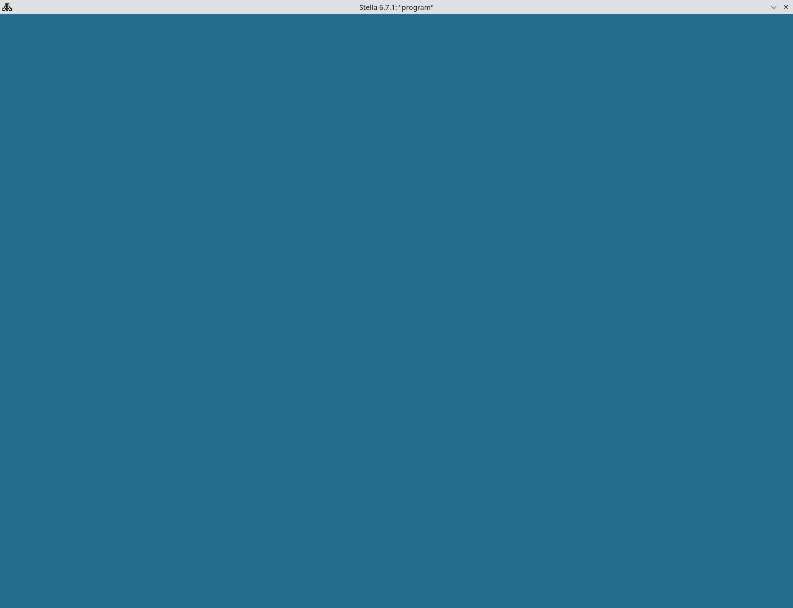

# baremetal-dasm

[](https://github.com/rbento/baremetal-dasm/actions/workflows/makefile.yml)
[](LICENSE)

A minimal starter template for bare-metal 6502 assembly programming, Atari games, and deliberate practice.

## Introduction and Goals

`baremetal-dasm` is a foundational project template for programming bare-metal MOS 6502 assembly using DASM. Designed for building standalone Atari ROMs, developing custom low-level routines from first principles, or sharpening architecture fundamentals through deliberate practice, this template provides a clean directory structure, POSIX build automation, out-of-source artifact isolation, and pre-wired editor tooling.

```bash
git clone https://github.com/rbento/baremetal-dasm.git my-project
cd my-project
./bootstrap.sh
make run
```



**Primary Goals:**
*   **Artifact Isolation:** Strictly separate output ROMs and list files from the source tree.
*   **Direct Hardware Execution:** Compile directly to raw binary format (`.bin`) for execution in an emulator (e.g., Stella) or flashed to physical cartridges.
*   **Minimalist Toolchain:** Assemble with `dasm` and navigate symbols using Universal Ctags.

## Architecture Constraints
*   **Target Architecture:** MOS 6502.
*   **Target OS:** Bare metal (e.g., Atari 2600 VCS).
*   **Assembler:** `dasm` (output format 3 - raw binary).
*   **Linker:** None.
*   **Debugger:** Stella Emulator (internal debugger).
*   **Tooling:** Universal Ctags (symbol indexing). No language server is used because DASM syntax lacks mainstream LSP support.

## System Scope and Context
*   **Context:** The template serves as a generic starting point for practicing 6502 assembly—building standalone Atari ROMs and experimenting with strict cycle-counted architecture.
*   **Technical Scope:** The pipeline consumes raw `.s` source implementations and `.inc` include headers, assembles them via a single-pass include tree, and outputs a raw native `.bin` ROM.

## Solution Strategy
*   **Out-of-Source Assembly:** Route the final ROM (`.bin`), symbol files (`.sym`), and list files (`.lst`) to a transient `build/` directory to keep `src/` and `include/` clean.
*   **Single-Entry Point:** Compile strictly through `src/main.s` because 6502 absolute memory mapping (`org`) requires a unified view of all includes rather than distinct linked object files.
*   **Tag-Based Navigation:** Rely on a `ctags` index for symbol lookup instead of an LSP, providing reliable jump-to-definition in lightweight editors.

## Building Block View
### Level 1: Directory Structure
*   `.editorconfig`: Enforces tab indentation (width 8) for assembly files to match standard DASM formatting.
*   `.gitignore`: Excludes `build/` and generated index files.
*   `bootstrap.sh`: Utility script to clean the environment, build diagnostic files, and generate tags.
*   `build/`: Transient output tree.
    *   `build/obj/`: Diagnostic files (`.sym`, `.lst`).
    *   `build/bin/`: Final raw binaries (`.bin`).
*   `src/`: Assembly implementations (`.s`).
*   `include/`: Assembly constants, macros, and hardware registers (`.inc`).
*   `Makefile`: Build rules and target definitions.

## Runtime View
### Standard Build Sequence
1.  `make` is executed.
2.  The assembler processes `src/main.s` (which natively parses all included `.inc` and `.s` files).
3.  The assembler directly outputs the final raw ROM to `build/bin/program.bin`.

### Environment Bootstrap Sequence (`bootstrap.sh`)
1.  Invokes `make clean` to purge existing build artifacts.
2.  Removes stale tag indexes (`tags`).
3.  Executes `make debug` to produce the ROM alongside `.sym` and `.lst` diagnostic files.
4.  Runs `ctags -R .` to index function signatures and identifiers for tag-based navigation.
5.  Prints the output paths of all generated artifacts.

## Cross-cutting Concepts
*   **Memory Mapping:** Memory layout relies on explicit `org` directives rather than linker scripts because the 6502 operates in a strict, predictable flat memory space.
*   **Code Style Enforcement:** `.editorconfig` manages whitespace rules directly in the editor because no standard auto-formatter exists for DASM.
*   **Debugging Instrumentation:** `make debug` instructs DASM to generate `.sym` (symbol) and `.lst` (list) files because standard emulators (like Stella) use these to map execution back to the source.

## Architecture Decisions
*   **ADR-01: Source File Extension:** Source files use `.s` instead of `.asm`. *Rationale:* Differentiates 6502/DASM projects visually and functionally from x86/NASM projects in editor configurations.
*   **ADR-02: Single-Pass Assembly:** Use DASM to compile directly to a ROM rather than linking object files. *Rationale:* 6502 development relies on absolute memory addressing; separating compilation and linking adds friction without benefit.
*   **ADR-03: Assembler Choice:** Use `dasm`. *Rationale:* It is the established standard for Atari VCS homebrew, ensuring maximum compatibility with existing community projects.

## Glossary
*   **Ctags:** An indexer that maps source symbols (labels, constants) for editor jump navigation.
*   **DASM:** A macro assembler supporting several 8-bit microprocessors including the MOS 6502.
*   **ROM:** Read-Only Memory. The raw `.bin` file formatted for execution on an emulator or physical cartridge.
*   **Stella:** The standard, cycle-exact emulator for the Atari 2600 used for execution and debugging.

## References
*   [arc42](https://arc42.org) - Architecture communication template.
*   [DASM Assembler](https://dasm-assembler.github.io/) - Referenced in §1, §2, §4, §6.1, §9, §12.
*   [Stella Emulator](https://stella-emu.github.io/) - Cycle-exact Atari 2600 emulator referenced in §1, §2, §8, §12.
*   [Universal Ctags](https://ctags.io) - Source code indexer referenced in §1, §2, §4, §6.2, §8, §12.
